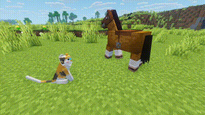

# Minecraft Pets Can Ride Horses

A 26.x minecraft datapack that allows nearest cat or wolf within a 5 block radius to ride horses with you (as pictured below).

- Compatible with my [Immortal Pets datapack](https://github.com/zeashel/mc-immortal-pets)
- [How to install](#installation)

## Features

- When a cat or wolf is within a 5 block radius when you mount a horse, the nearest cat/wolf will mount the horse with you in the passenger seat.
- When you dismount the horse, the cat or dog will automatically dismount the horse as well.
- If there are no cats or wolves within a 5 block radius when you mount a horse, horses function as usual.

## Dependencies

- Vanilla minecraft version 26.1.x–26.2
- Requires the Invisible Acacia Boat resourcepack [included in this repo](invisible_acacia_boat/). If you have Optifine or EMF, normal acacia boats will remain unaffected.

## Optional Dependencies

- Optifine or [EMF](https://modrinth.com/mod/entity-model-features)
- [Fresh Animations resourcepack](https://modrinth.com/resourcepack/fresh-animations).

These are not required and the mod will still function fine in vanilla minecraft, but it highly improves the animations of your pets sitting on the horse and removes the invisible water visual glitch!

## Installation

1. Download the .zip file from this [github's releases](https://github.com/zeashel/mc-pets-can-ride-horses/releases) or the modrinth page (pending).
2. Unzip the file.
3. Drag and drop the `pets_can_ride_horses...` folder into your local world or server's datapack folder (the name will depend on the version you installed). Example:
    - Mac: `~/Library/Application Support/minecraft/saves/My World Name/datapacks/pets_can_ride_horses_v0.1_26.1.2`
    - Windows: `%appdata%\.minecraft\saves\My World Name\datapacks\pets_can_ride_horses_v0.1_26.1.2`
4. When you open the world, you should see a message like `[Server] Pets Ride Horses datapack v0.1 loaded.`. This means the installation is successful.

## Known Issues

- Without Optifine/EMF installed, all acacia boats will be invisible.
- Without Optifine/EMF installed, there will be a slight visual glitch of an invisible water patch when riding a horse.

So far I have not found a vanilla workaround as vanilla doesn't allow CEMs.

## Reporting

This mod has been thoroughly tested in singleplayer but should also work on multiplayer as well, and no issues have been found other than the ones mentioned above. If you experience any unreported problems, please report it as a [github issue here](https://github.com/zeashel/mc-pets-can-ride-horses/issues).
